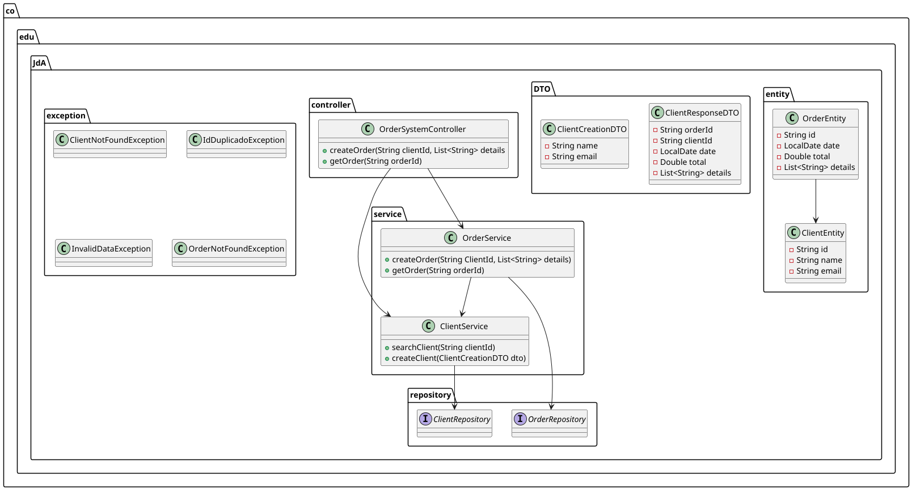

# Exceptions and Logs

This is an educational project using Spring Boot to create an API for generating service orders, focusing on the implementation of exceptions and logging.

## Table of contents

1. [Overview](#overview)
2. [Technologies](#technologies)
3. [UML Diagram](#UML-diagram)
4. [Getting Started](#getting-started)
5. [Usage](#usage)
6. [Project Structure](#project-structure)
7. [License](#license)

## Overview

This project demonstrates the use of Spring Boot to build a REST API for managing service orders. It emphasizes the implementation of custom exceptions and logging mechanisms to handle errors effectively.

## Technologies

- Java
- Spring Boot
- Maven
- Docker
- SQL (MySQL)

## UML Diagram



## Getting Started

### Prerequisites

- Java 21
- Maven 3.8+
- Docker (optional, for containerized deployment)

### Installation

1. Clone the repository:
   ```bash
   git clone https://github.com/DJAngel973/exceptions-and-logs.git
   cd exceptions-and-logs
   ```
   
### Build the project

1. Build the project using Maven:
    ```bash
   ./mvnw clean install
   ```
2. Run the application:
    ```bash
   ./mvnw spring-boot:run
   ```
3. (optional) Run the application in a Docker container:
    ```bash
   docker-compose up
   ```
4. Access the API in your browser or a tool like Postman:
    ```bash
   http://localhost:8080
   ```
   
## Usage

- **API Endpoints**:
    - `POST /clients`: Create a new client.
    - `GET /clients/{id}`: Get details about a client.
    - `POST /orders`: Create a new service order.
    - `GET /orders/{id}`: Get details of an order.

- **Error handling**:
  - `ClientNotFoundException`: It is launched when a client is not found.
  - `OrderNotFoundException`: It is thrown when an order is not found.
  - `InvalidDataException`: Thrown when input data is invalid.
  - `IdDuplicadoException`: Thrown when attempting to register a duplicate ID.

## Project Structure

```plaintext
src/
├── main/
│   ├── java/co/edu/JdA/
│   │   ├── Main.java
│   │   ├── controller/
│   │   │   └── OrderSystemController.java
│   │   ├── DTO/
│   │   │   ├── ClientCreationDTO.java
│   │   │   └── ClientResponseDTO.java
│   │   ├── entity/
│   │   │   ├── ClientEntity.java
│   │   │   └── OrderEntity.java
│   │   ├── exception/
│   │   │   ├── ClientNotFoundException.java
│   │   │   ├── IdDuplicadoException.java
│   │   │   ├── InvalidDataException.java
│   │   │   └── OrderNotFoundException.java
│   │   ├── repository/
│   │   │   ├── ClientRepository.java
│   │   │   └── OrderRepository.java
│   │   └── service/
│   │       ├── ClientService.java
│   │       └── OrderService.java
│   └── resources/
│       ├── db/migration/
│       │   └── V2__add_registration_date.sql
│       └── application.properties
├── docs/
│   ├── UML-diagram.png
│   └── UML.plantuml
└── docker/
    └── V1__init.sql
```

## License

This project is licensed under the MIT License. See the `LICENSE` file for details.


